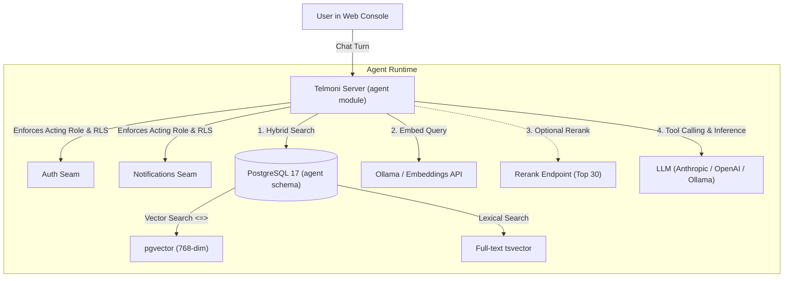

import { Steps, Tabs, TabItem } from '@astrojs/starlight/components';

Telmoni includes an embedded AI context agent directly in the console. The agent answers questions about your project, recent errors, delivery failures, membership, and documentation—citing the exact records it referenced.

In self-hosted environments, the agent can run in two modes:
1. **Completely Offline & Air-Gapped**: Using a local Ollama container for both embeddings and chat generation. No prompts or data ever leave your network.
2. **Hybrid / Hosted Providers**: Using local in-cluster embeddings paired with an external frontier model API (Anthropic Claude, OpenAI, or Google Gemini).

---

## Agent architecture & security model



### The 5 read-only tools

The agent has access to five internal inspection tools:

| Tool Name | Scope | Description |
| :--- | :--- | :--- |
| `search` | Project | Hybrid search over documentation, audit logs, activity feeds, connector deliveries, and previous conversational turns. Fuses `pgvector` cosine similarity and PostgreSQL `tsvector` using reciprocal rank fusion. |
| `list_members` | Organization | Lists active members, pending invitations, and RBAC roles for the organization. |
| `list_connectors` | Project | Inspects configured Slack channels, Discord webhooks, and HTTP webhook subscriptions. |
| `connector_deliveries` | Project | Fetches recent notification delivery attempts, response codes, latency metrics, and error payloads. |
| `audit_events` | Organization | Queries the cryptographically linked audit ledger for specific actions, actors, and targets. |

### Strict read-only tenant isolation

- **No Mutating Capabilities**: The agent cannot create, update, or delete resources. The worst a poisoned document or log line can do is mislead a response; it can never alter project state.
- **Row-Level Security (RLS)**: The agent connects to PostgreSQL using the `telmoni_agent` role, which enforces `NOBYPASSRLS`. Every query filters through the requesting user's identity and organization scope. If a user does not have permission to view audit logs, the agent's `audit_events` tool returns an access-denied error.

---

## Vector dimensions & embedding models

Telmoni sizes its PostgreSQL vector columns (`agent.chunks.embedding`) for **768-dimensional embeddings**, optimized for `nomic-embed-text`.

> [!IMPORTANT]
> The backend server validates the vector width at boot time (`probe_width`). If your configured embeddings endpoint returns a vector width other than 768, the server immediately halts to prevent inserting mismatched vectors or corrupting vector similarity indices.

---

## Deployment methods

### Option 1: Completely local with Docker Compose

Run the entire agent stack (Ollama + local embeddings) on a single machine:

<Steps>

1. **Start the stack with the agent profile**

   ```bash
   docker compose -f deploy/compose/docker-compose.yml --profile agent up -d
   ```

2. **Pull the required models**

   Pull the 768-dimensional embedding model:

   ```bash
   docker compose -f deploy/compose/docker-compose.yml exec ollama ollama pull nomic-embed-text
   ```

   (Optional) If running chat inference locally as well, pull a local instruction-tuned model:

   ```bash
   docker compose -f deploy/compose/docker-compose.yml exec ollama ollama pull llama3.2
   ```

3. **Configure environment variables in `.env`**

   ```sh
   # Embeddings (required when agent is enabled)
   EMBEDDINGS_URL=http://ollama:11434/v1
   EMBEDDINGS_MODEL=nomic-embed-text

   # Local chat inference via Ollama
   AGENT_MODEL_PROVIDER=openai
   AGENT_MODEL_URL=http://ollama:11434/v1
   AGENT_MODEL=llama3.2
   ```

4. **Restart the server**

   ```bash
   docker compose -f deploy/compose/docker-compose.yml restart server
   ```

</Steps>

---

### Option 2: Kubernetes with the official Helm chart

When using the Telmoni Helm chart, enable the in-cluster embeddings sub-deployment:

```yaml
# values-prod.yaml
config:
  agent:
    modelProvider: "anthropic"
    model: "claude-sonnet-5"
    embeddingsModel: "nomic-embed-text"
    # When embeddingsUrl is empty and embeddings.enabled is true,
    # the chart automatically routes to http://embeddings:11434/v1

embeddings:
  enabled: true
  model: "nomic-embed-text"
  resources:
    requests:
      cpu: "1000m"
      memory: "2Gi"
    limits:
      memory: "4Gi"
```

The Helm chart automatically deploys Ollama, applies an init probe that pulls `nomic-embed-text`, and enforces a `NetworkPolicy` permitting ingress only from the `server` pods.

---

### Option 3: Hosted LLM with local embeddings (Hybrid)

You can run embeddings locally for data privacy while querying frontier models (Anthropic Claude or OpenAI) for reasoning:

<Tabs>
  <TabItem label="Anthropic Claude">
    ```sh
    # .env
    AGENT_MODEL_PROVIDER=anthropic
    AGENT_MODEL=claude-sonnet-5
    AGENT_MODEL_API_KEY=sk-ant-api03-...

    # Local embeddings
    EMBEDDINGS_URL=http://ollama:11434/v1
    EMBEDDINGS_MODEL=nomic-embed-text
    ```
  </TabItem>
  <TabItem label="OpenAI">
    ```sh
    # .env
    AGENT_MODEL_PROVIDER=openai
    AGENT_MODEL=gpt-4o
    AGENT_MODEL_API_KEY=sk-proj-...

    # Local embeddings
    EMBEDDINGS_URL=http://ollama:11434/v1
    EMBEDDINGS_MODEL=nomic-embed-text
    ```
  </TabItem>
</Tabs>

---

## Documentation indexing & re-indexing

The agent uses a curated corpus of documentation to answer architecture and troubleshooting questions.

- **Corpus Source**: By default, the agent reads `https://docs.telmoni.com/llms-full.txt`.
- **Offline / Air-Gapped Environments**: In offline deployments, set `DOCS_CORPUS_URL` to an internal HTTP endpoint serving your markdown corpus, or set `DOCS_CORPUS_URL=off` to index only project runtime data and audit trails.
- **Manual Re-indexing**: To re-index all documentation and project metadata on demand:

```bash
# Docker Compose
docker compose -f deploy/compose/docker-compose.yml exec server telmoni sweep agent-reindex

# Kubernetes
kubectl exec -it deployment/server -n telmoni -- telmoni sweep agent-reindex
```
