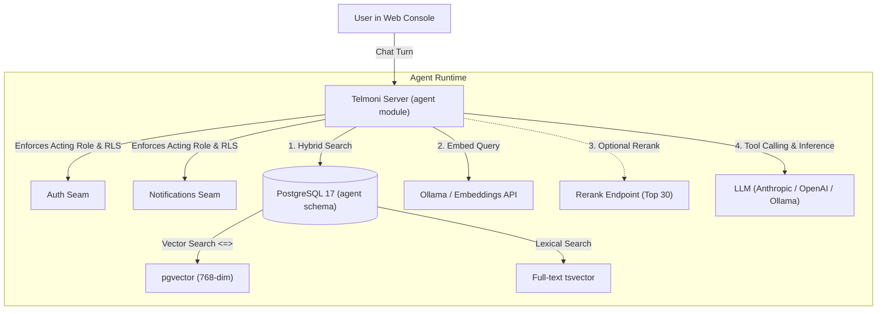

import { Steps, Tabs, TabItem } from '@astrojs/starlight/components';

Telmoni includes an embedded AI context agent directly in the console. The agent answers questions about your project, recent errors, delivery failures, membership, and documentation—citing the exact records it referenced.

In self-hosted environments, the agent can run in two modes:
1. **Completely Offline & Air-Gapped**: Using a local Ollama container for both embeddings and chat generation. No prompts or data ever leave your network.
2. **Hybrid / Hosted Providers**: Using local in-cluster embeddings paired with an external frontier model API (Anthropic Claude, OpenAI, or Google Gemini).

---

## Agent architecture & security model



### The 5 read-only tools

The agent has access to five internal inspection tools:

| Tool Name | Scope | Description |
| :--- | :--- | :--- |
| `search` | Project | Hybrid search over documentation, audit logs, activity feeds, connector deliveries, and previous conversational turns. Fuses `pgvector` cosine similarity and PostgreSQL `tsvector` using reciprocal rank fusion. |
| `list_members` | Project | Lists the project's members and their roles, as the project's members page shows them. |
| `list_connectors` | Project | Inspects configured Slack channels, Discord webhooks, and HTTP webhook subscriptions. |
| `connector_deliveries` | Project | Fetches recent notification delivery attempts, response codes, latency metrics, and error payloads. |
| `audit_events` | Project | Queries the audit log by actor, action, and time: the project's events for a role that can read its audit log, and the whole organization's for the organization's owner and admins. |

### Strict read-only tenant isolation

- **No Mutating Capabilities**: The agent cannot create, update, or delete resources. The worst a poisoned document or log line can do is mislead a response; it can never alter project state.
- **Row-Level Security (RLS)**: In production (a database prepared with `role_hardening.sql`, as the [production guide](/self-host/production/) describes), the agent connects to PostgreSQL as the `agent` role, which enforces `NOBYPASSRLS`. Each search also names the requesting user, organization, and project in the query itself, so the isolation holds under the Docker Compose quickstart too, which connects every module as the database superuser. The agent checks the user's role again before every tool call, so a role removed mid-answer applies to the next lookup, and a user signed out or removed from the project mid-answer ends the answer there, with nothing more sent or saved. If a user does not have permission to view audit logs, the agent's `audit_events` tool returns an access-denied error.

---

## Vector dimensions & embedding models

Telmoni sizes its PostgreSQL vector columns (`agent.chunks.embedding`) for **768-dimensional embeddings**, optimized for `nomic-embed-text`.

The agent needs **pgvector 0.8 or later** in Telmoni's database: its search uses pgvector's iterative index scans for larger organizations (a small one's passages are compared exactly, so it gets a full set of results however large the index), and the migration stops on an older version. The `pgvector/pgvector:pg17` image in the Docker Compose stack ships a current release; on a managed database, check which version its `vector` extension offers.

> [!IMPORTANT]
> The server checks the vector width at boot (`probe_width`). If your embeddings endpoint answers with a width other than 768, the server refuses to start rather than write vectors that don't fit. If the endpoint isn't answering yet (Ollama still pulling the model, say), the server starts anyway, and the indexer checks the width at the endpoint's first answer and stops indexing on a mismatch.

---

## Embeddings endpoint handling & retry behaviour

When indexing passages from audit logs, feed notices, deliveries, and documentation, the indexer interacts with the configured embeddings endpoint according to specific mechanisms (`crates/agent/src/index/mod.rs`):

- **Batch halving**: A batch of passages that fails is split in halves and retried, down to individual passages.
- **Passage retries and truncation**: A passage that fails on its own is requested a second time. If it fails again, it is cut in half and retried, so a passage too long for the model is embedded from its opening.
- **Unembeddable passages**: A passage that fails at every length is left out of the index.
- **Rate limiting**: A rate limit (429) is waited out, a minute at a time.
- **Transient failures and backoff**: A timeout, 408, 503, or 529 on a single passage fails the page, which is retried after five minutes.
- **Documentation corpus**: Documentation search requires the documentation site to publish `llms-full.txt` (the default `DOCS_CORPUS_URL`), which the agent polls every 24 hours (or retries after one hour if a fetch fails).

---

## Deployment methods

### Option 1: Completely local with Docker Compose

Run the entire agent stack (Ollama + local embeddings) on a single machine:

<Steps>

1. **Start the stack with the agent profile**

   ```bash
   docker compose -f deploy/compose/docker-compose.yml --profile agent up -d
   ```

2. **Pull the required models**

   Pull the 768-dimensional embedding model:

   ```bash
   docker compose -f deploy/compose/docker-compose.yml exec ollama ollama pull nomic-embed-text
   ```

   (Optional) If running chat inference locally as well, pull a local instruction-tuned model:

   ```bash
   docker compose -f deploy/compose/docker-compose.yml exec ollama ollama pull llama3.2
   ```

3. **Configure environment variables in `deploy/compose/.env`**

   ```sh
   # Embeddings (required when agent is enabled)
   EMBEDDINGS_URL=http://ollama:11434/v1
   EMBEDDINGS_MODEL=nomic-embed-text

   # Local chat inference via Ollama
   AGENT_MODEL_PROVIDER=openai
   AGENT_MODEL_URL=http://ollama:11434/v1
   AGENT_MODEL=llama3.2
   ```

4. **Recreate the server**

   `restart` keeps the container's old environment, so the server is recreated to pick up `deploy/compose/.env`:

   ```bash
   docker compose -f deploy/compose/docker-compose.yml --profile agent up -d server
   ```

</Steps>

---

### Option 2: Kubernetes with the official Helm chart

When using the Telmoni Helm chart, enable the in-cluster embeddings sub-deployment:

```yaml
# values-prod.yaml
config:
  agent:
    modelProvider: "anthropic"
    model: "claude-sonnet-5"
    embeddingsModel: "nomic-embed-text"
    # When embeddingsUrl is empty and embeddings.enabled is true,
    # the chart automatically routes to http://embeddings:11434/v1

embeddings:
  enabled: true
  model: "nomic-embed-text"
  resources:
    requests:
      cpu: "1000m"
      memory: "2Gi"
    limits:
      memory: "4Gi"
```

The Helm chart deploys Ollama, whose start script pulls the `embeddings.model` before the pod reports ready, and enforces a `NetworkPolicy` permitting ingress only from the `server` pods.

A hosted model also needs its key in the `server-secrets` Secret, beside `AGENT_DATABASE_URL`: add `--from-literal=AGENT_MODEL_API_KEY="sk-ant-api03-..."` to the `server-secrets` command in the [Kubernetes guide](/self-host/kubernetes/). Without it, a server pointed at a hosted API refuses to start.

---

### Option 3: Hosted LLM with local embeddings (Hybrid)

You can run embeddings locally for data privacy while querying frontier models (Anthropic Claude or OpenAI) for reasoning:

<Tabs>
  <TabItem label="Anthropic Claude">
    ```sh
    # deploy/compose/.env
    AGENT_MODEL_PROVIDER=anthropic
    AGENT_MODEL=claude-sonnet-5
    AGENT_MODEL_API_KEY=sk-ant-api03-...

    # Local embeddings
    EMBEDDINGS_URL=http://ollama:11434/v1
    EMBEDDINGS_MODEL=nomic-embed-text
    ```
  </TabItem>
  <TabItem label="OpenAI">
    ```sh
    # deploy/compose/.env
    AGENT_MODEL_PROVIDER=openai
    AGENT_MODEL=gpt-4o
    AGENT_MODEL_API_KEY=sk-proj-...

    # Local embeddings
    EMBEDDINGS_URL=http://ollama:11434/v1
    EMBEDDINGS_MODEL=nomic-embed-text
    ```
  </TabItem>
</Tabs>

---

## Documentation indexing & re-indexing

The agent uses a curated corpus of documentation to answer architecture and troubleshooting questions.

- **Corpus Source**: By default, the agent reads `https://docs.telmoni.com/llms-full.txt`.
- **Offline / Air-Gapped Environments**: In offline deployments, set `DOCS_CORPUS_URL` to an internal HTTP endpoint serving your markdown corpus, or set `DOCS_CORPUS_URL=off` to index only project runtime data and audit trails.
- **Re-embedding after a model change**: After you change `EMBEDDINGS_MODEL`, re-embed every passage the previous model embedded. Until it finishes, those passages are found by exact terms only:

```bash
# Docker Compose
docker compose -f deploy/compose/docker-compose.yml exec server /app/telmoni sweep agent-reindex

# Kubernetes
kubectl exec -it deployment/server -n telmoni -- /app/telmoni sweep agent-reindex
```
