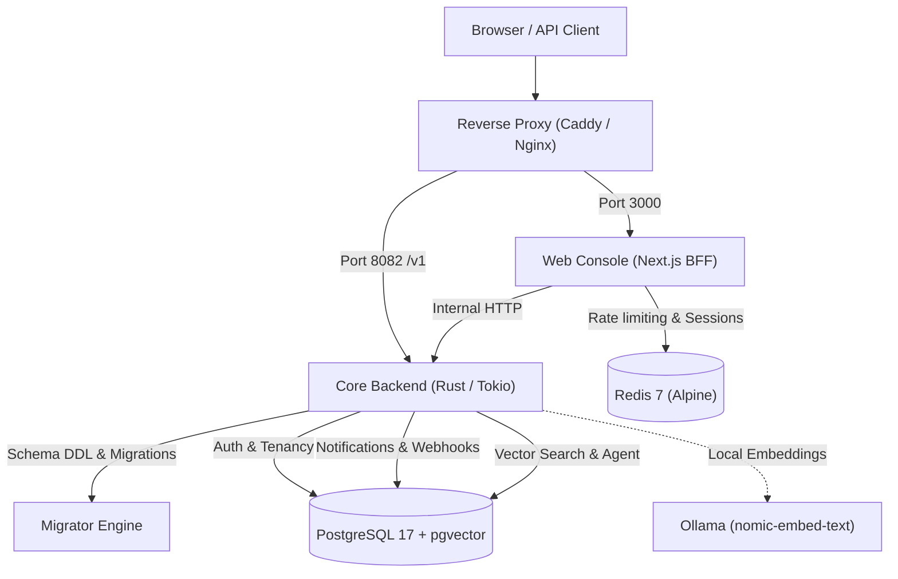

import { Card, CardGrid } from '@astrojs/starlight/components';

Telmoni open core is designed to be fully self-hosted on your own infrastructure without dependencies on proprietary cloud services. All core functionality—including organization management, project scoping, audit logging, webhook connectors, notifications, and AI search—runs inside your own network perimeter.

## System architecture

The Telmoni deployment consists of five primary components:

### Component breakdown

1. **Core Backend (`telmoni serve`)**: A high-performance, single-binary Rust service built on Axum and Tokio. It exposes the REST and internal service APIs on port `8082`, executes tenant-isolated database queries with Row-Level Security (RLS), signs webhook payloads, dispatches notifications, and runs automated maintenance loops (retention purges, soft-deletion sagas, and nightly audit verification walks).
2. **Web Console (`telmoni/web`)**: A Next.js application that serves the dashboard, handles server-side session cookies (sealed with `AUTH_SECRET`), proxies authenticated requests to the backend server, and performs edge rate limiting.
3. **PostgreSQL 17 with `pgvector`**: The primary relational store. Telmoni uses native partitioning for the audit ledger and the `vector` extension for semantic document search. In production, each service module (`auth`, `notifications`, `agent`, `migrator`) connects using a hardened, least-privilege database role.
4. **Redis 7**: An in-memory cache used by the web console for sliding-window rate limiting and session synchronization. Bearer tokens are SHA-256 hashed before reaching Redis to prevent token exposure in cache memory. Because rate-limit windows carry microsecond expirations (`PEXPIRE`), Redis requires no disk snapshots (`--save ""`).
5. **Migrator (`telmoni migrate`)**: A one-shot CLI command packaged within the backend binary. It executes pending database migrations and applies owner grants before the server boots.
6. **AI Agent & Embeddings (Optional)**: Telmoni includes an embedded context assistant. For completely offline or air-gapped deployments, an optional Ollama sidecar serves `nomic-embed-text` embeddings and local LLM inferences. Hosted providers (Anthropic Claude, OpenAI, or Google Gemini) can be configured via environment variables.

---

## Production recommendations checklist

When moving from a local evaluation or single-node Docker quickstart to a production environment, follow these best practices:

- **Enterprise OIDC Authentication (Recommended)**: While the email and password setup (`ADMIN_EMAIL` / `ADMIN_PASSWORD`) is provided to bootstrap an instance quickly, we strongly recommend connecting an OpenID Connect (OIDC) identity provider (Okta, Keycloak, Microsoft Entra ID, Authentik, Google Workspace). Once OIDC is tested, disable the password form entirely via `DISABLE_LOGIN_FORM=true` to eliminate credential stuffing and enforce corporate MFA.
- **Database Least-Privilege & RLS**: Never connect application pools as a PostgreSQL superuser. Apply `crates/migrator/sql/role_hardening.sql` to enforce `NOBYPASSRLS` across `auth`, `notifications`, and `agent` roles.
- **Reverse Proxy with TLS**: Never expose internal ports `3000` or `8082` directly to the internet. Always terminate TLS using Caddy, Nginx, or a cloud Ingress controller.
- **Audit Partition Maintenance**: Schedule `telmoni rotate` weekly via cron or a Kubernetes CronJob to maintain the 4-month forward partition runway.
- **Encryption Key Retention**: Store `CONNECTOR_KEK` securely in a secret manager or Cloud KMS. Back up this key alongside your database dumps to ensure connector credentials remain decryptable.

---

## Hardware and system requirements

### Minimum specifications (small organizations & evaluation)

- **CPU**: 2 vCPUs
- **Memory**: 4 GB RAM (8 GB if running local Ollama models)
- **Disk**: 20 GB SSD storage
- **Operating System**: Linux (Ubuntu 22.04+, Debian 12+, RHEL 9+) or macOS

### Recommended production specifications (100+ active seats)

- **CPU**: 4+ vCPUs
- **Memory**: 8 GB to 16 GB RAM
- **Disk**: 100+ GB high-IOPS NVMe storage (PostgreSQL write-ahead logs and partitioned audit tables)
- **Network**: Low-latency link between the backend, Redis, and PostgreSQL instances

---

## Deployment methods

Choose the deployment workflow that fits your infrastructure:

<CardGrid>
  <Card title="Docker Compose" icon="rocket">
    The recommended deployment method for single-node installations. Runs PostgreSQL, Redis, the migration engine, the core server, and the web console with healthcheck dependencies.
    
    [Read Docker Compose guide](/self-host/docker-compose/)
  </Card>
  <Card title="Kubernetes & Helm" icon="seti:kubernetes">
    Deploy scalable, highly available replicas using our production Helm chart located in `deploy/charts/telmoni`.
    
    [Read Kubernetes guide](/self-host/kubernetes/)
  </Card>
  <Card title="Self-Hosted AI Agent" icon="star">
    Configure offline vector embeddings with Ollama, hybrid search, read-only tools, and documentation corpus indexing.
    
    [Read Agent guide](/self-host/agent/)
  </Card>
  <Card title="Production Hardening" icon="warning">
    Configure enterprise OIDC, hardened PostgreSQL roles, automated audit partition rotations, and TLS reverse proxies.
    
    [Read Production guide](/self-host/production/)
  </Card>
</CardGrid>
